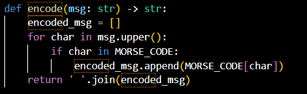
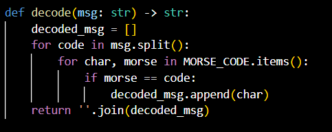
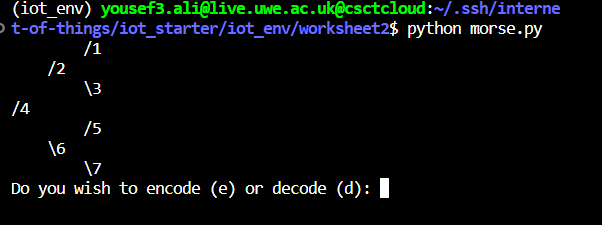
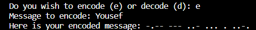
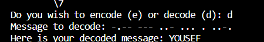

# Morse-code-encoder-and-decoder

<h1 align="center"> Encode </h1>

# Encoder Implementation 

I have implemented the encode function by taking in the string "msg" and returns the encoded version using the morse code dictionary defined previously. Below is the functions code.

# Decoder Implementation

This function takes in a string msg representing an encoded message in Morse code then refers to the dictionary to decode the morsecode back into english and returns the decoded version of the message as a string.

# How it works

As soon as you run the code a message is outputted asking the user whether they want to encode or decode as shown below.

If User inputs "e" the encode function is called and the inputted String is translated into morse code.

If User were to input "d" the decode function would come to work and refer to the dictionary to decode the string back to english. Below is the output.

